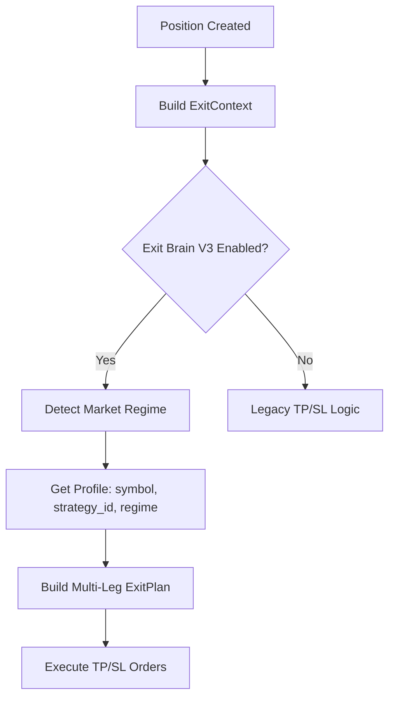

# Exit Brain V3 - TP Profile System 🎯

**Status**: ✅ **PRODUCTION READY** (Dec 10, 2024)

## Overview

Exit Brain V3 now includes a sophisticated **TP Profile System** that provides:
- 🎚️ **Multi-leg TP ladders** (TP1/TP2/TP3) with configurable R multiples
- 🎭 **Hard vs Soft TP execution** (market orders vs limit orders)
- 🌊 **Regime-specific profiles** (TREND/RANGE/VOLATILE/CHOP)
- 📊 **Trailing profiles** with dynamic tightening curves
- 🔧 **Symbol and strategy-specific overrides**
- 🔄 **Full backward compatibility** with legacy mode

## Architecture

### Core Components

```
backend/domains/exits/exit_brain_v3/
├── models.py              # ExitContext, ExitPlan, ExitLeg
├── tp_profiles_v3.py      # NEW: Profile system
├── planner.py             # Enhanced with profile support
├── integration.py         # Bridge to execution layers
└── __init__.py           # Public API
```

### Profile System Flow



## TP Profile Structure

### TPProfile Components

```python
@dataclass
class TPProfileLeg:
    r_multiple: float       # 1.0 = 1R (SL distance)
    size_fraction: float    # 0.0-1.0 (portion of position)
    kind: TPKind           # HARD (market) or SOFT (limit)

@dataclass
class TrailingProfile:
    callback_pct: float     # Initial callback (e.g., 0.015 = 1.5%)
    activation_r: float     # Start trailing at this R
    tightening_curve: List[tuple[float, float]]
                           # [(r_threshold, new_callback), ...]

@dataclass
class TPProfile:
    name: str
    tp_legs: List[TPProfileLeg]
    trailing: Optional[TrailingProfile]
    description: str
```

### Example: TREND Profile

```python
DEFAULT_TREND_PROFILE = TPProfile(
    name="TREND_DEFAULT",
    tp_legs=[
        TPProfileLeg(r_multiple=0.5, size_fraction=0.15, kind=TPKind.SOFT),
        TPProfileLeg(r_multiple=1.0, size_fraction=0.20, kind=TPKind.HARD),
        TPProfileLeg(r_multiple=2.0, size_fraction=0.30, kind=TPKind.HARD),
    ],
    trailing=TrailingProfile(
        callback_pct=0.020,  # 2% trailing for remaining 35%
        activation_r=1.5,
        tightening_curve=[
            (3.0, 0.015),  # At 3R, tighten to 1.5%
            (5.0, 0.010),  # At 5R, tighten to 1.0%
        ]
    )
)
```

**TP Ladder** (assuming 2% SL):
- **TP1** (15%): 0.5R = 1.0% profit (SOFT - limit order)
- **TP2** (20%): 1.0R = 2.0% profit (HARD - market order)
- **TP3** (30%): 2.0R = 4.0% profit (HARD - market order)
- **TRAIL** (35%): Starts at 1.5R with 2% callback, tightens as profit grows

## Market Regimes

### Profile Selection

System automatically selects appropriate profile based on:
1. **Market Regime**: TREND/RANGE/VOLATILE/CHOP/NORMAL
2. **Symbol**: Optional symbol-specific overrides
3. **Strategy ID**: Optional strategy-specific overrides

### Default Profiles

| Regime | TP Approach | Trailing | Description |
|--------|-------------|----------|-------------|
| **TREND** | Let profits run (0.5R, 1R, 2R) | ✅ 2% callback, tightens at 3R/5R | Trend-following |
| **RANGE** | Quick exits (0.3R, 0.6R, 1R) | ❌ None | Scalp mode |
| **VOLATILE** | Conservative (0.4R, 0.8R, 1.5R) | ✅ 2.5% callback, no tightening | Wider stops |
| **CHOP** | Very quick (0.25R, 0.5R, 0.75R) | ❌ None | Exit fast |
| **NORMAL** | Balanced (0.5R, 1R, 2R) | ✅ 1.5% callback | Default |

## Profile Fallback Hierarchy

Profiles are selected with this specificity order:

1. **(symbol, strategy_id, regime)** - Most specific
2. **(symbol, strategy_id, ANY)** - Symbol + strategy default
3. **(symbol, ANY, regime)** - Symbol + regime default
4. **(ANY, strategy_id, regime)** - Strategy + regime default
5. **(ANY, ANY, regime)** - Regime default
6. **(ANY, ANY, NORMAL)** - Global default

**Example**:
```python
# Custom BTC profile for RL_V3 strategy in TREND markets
register_custom_profile(
    custom_btc_profile,
    symbol="BTCUSDT",
    strategy_id="RL_V3",
    regime=MarketRegime.TREND
)
```

## Configuration

### Enable/Disable Profiles

```python
# Use profile system (NEW)
brain = ExitBrainV3(config={"use_profiles": True, "strategy_id": "RL_V3"})

# Use legacy mode (BACKWARD COMPATIBLE)
brain = ExitBrainV3(config={"use_profiles": False})
```

### Environment Variables

```bash
# Enable Exit Brain V3 (already in .env)
EXIT_BRAIN_V3_ENABLED=true
```

## Integration Points

### Position Monitor

Exit Brain V3 is **now ENABLED** in `position_monitor.py`:
```python
# Line 427: Re-enabled Exit Brain V3 delegation
if EXIT_BRAIN_V3_ENABLED and EXIT_BRAIN_V3_AVAILABLE:
    logger_exit_brain.info(f"[EXIT BRAIN V3] {symbol}: Profile-based TP active")
```

### Execution Flow

1. **Position Monitor** detects new position
2. Builds **ExitContext** with market regime
3. **Exit Brain V3** selects appropriate profile
4. Constructs **multi-leg ExitPlan**
5. **Integration helpers** convert to execution parameters:
   - `to_dynamic_tpsl()` → DynamicTPSL params
   - `to_trailing_config()` → TrailingStopManager config
   - `to_partial_exit_config()` → Partial exit levels

## Custom Profile Creation

### Define Custom Profile

```python
from backend.domains.exits.exit_brain_v3 import (
    TPProfile, TPProfileLeg, TrailingProfile, TPKind,
    MarketRegime, register_custom_profile
)

# Create aggressive scalp profile
scalp_profile = TPProfile(
    name="AGGRESSIVE_SCALP",
    tp_legs=[
        TPProfileLeg(r_multiple=0.2, size_fraction=0.5, kind=TPKind.SOFT),
        TPProfileLeg(r_multiple=0.4, size_fraction=0.5, kind=TPKind.HARD),
    ],
    trailing=None,  # No trailing in scalp mode
    description="Aggressive scalp: exit fast"
)

# Register for all ETHUSDT trades in RANGE regime
register_custom_profile(
    scalp_profile,
    symbol="ETHUSDT",
    strategy_id="*",  # Any strategy
    regime=MarketRegime.RANGE
)
```

### Trailing Tightening Example

```python
# Tighten trailing stop as profit increases
trailing = TrailingProfile(
    callback_pct=0.025,  # Start at 2.5%
    activation_r=1.0,    # Activate at 1R profit
    tightening_curve=[
        (2.0, 0.020),  # At 2R, tighten to 2.0%
        (3.0, 0.015),  # At 3R, tighten to 1.5%
        (5.0, 0.010),  # At 5R, tighten to 1.0%
        (8.0, 0.005),  # At 8R, lock tight at 0.5%
    ]
)
```

## Testing

All tests passing ✅:
```bash
# TP Profile system tests
pytest tests/domains/exits/test_tp_profiles_v3.py -v
# 16 passed

# Exit Brain V3 basic tests (backward compatibility)
pytest tests/domains/exits/test_exit_brain_v3_basic.py -v
# 5 passed

# Integration tests
pytest tests/domains/exits/test_exit_integration_v3.py -v
# 6 passed
```

## Monitoring & Metrics

### Log Messages

Profile selection is logged:
```
[TP PROFILES] Selected 'TREND_DEFAULT' for BTCUSDT/RL_V3/TREND (specificity=1)
[EXIT BRAIN] Using profile 'TREND_DEFAULT' for BTCUSDT (regime=TREND, SL=2.5%)
[EXIT BRAIN] Plan created: 4 legs, Strategy=STANDARD_LADDER, Profile=TREND_DEFAULT
```

### ExitPlan Metadata

Every plan tracks:
```python
plan.profile_name      # "TREND_DEFAULT"
plan.market_regime     # "TRENDING"
plan.legs[0].r_multiple          # 0.5
plan.legs[0].profile_leg_index   # 0
plan.legs[0].metadata            # {"profile_name": "TREND_DEFAULT", "kind": "SOFT"}
```

## Backward Compatibility

### Legacy Mode

Old behavior preserved when `use_profiles=False`:
- Uses `partial_template` from config
- No profile selection
- Same 3-leg structure (TP1, TP2, TP3/TRAIL)

### Migration Path

1. **Phase 1** (Current): Exit Brain V3 active with profiles, Position Monitor checks for existing orders
2. **Phase 2** (Optional): Add dashboard for profile performance metrics
3. **Phase 3** (Optional): RL-based profile optimization

## Known Limitations

1. **Memory-based tracking**: `_protected_positions` resets on service restart
2. **No persistent profile history**: Could add to database for analytics
3. **Static profiles**: Future: dynamic profile adjustment based on performance

## Future Enhancements

- [ ] Profile performance dashboard
- [ ] RL-based profile tuning
- [ ] Volatility-adaptive tightening curves
- [ ] CLM integration for liquidity-aware exits
- [ ] Profile A/B testing framework

## References

- **Implementation**: `backend/domains/exits/exit_brain_v3/tp_profiles_v3.py`
- **Tests**: `tests/domains/exits/test_tp_profiles_v3.py`
- **Integration**: Position Monitor line 427, Planner line 182
- **Status**: AI_INTEGRATION_STATUS.md, AI_COMPLETE_MODULE_OVERVIEW.md

---

**Status**: ✅ Production ready  
**Author**: AI Agent  
**Date**: December 10, 2024  
**Version**: 3.0  
