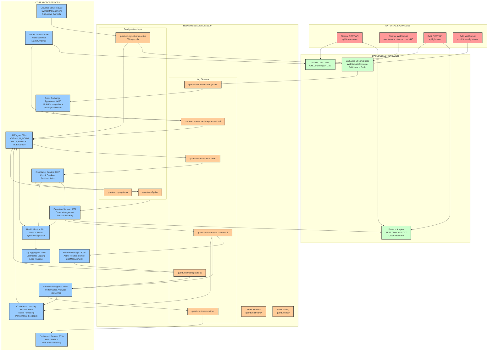

# 🔌 QUANTUM TRADER SYSTEM WIRING MAP

**Document Version**: 1.0  
**Last Updated**: February 10, 2026  
**System Status**: ⚠️ AI Engine ML Models Offline (Fallback Mode Active)

---

## 🏗️ SYSTEM ARCHITECTURE OVERVIEW



---

## 🌐 EXTERNAL INTEGRATIONS

### **Exchange Connections**
| Exchange | REST API | WebSocket | Purpose |
|----------|----------|-----------|---------|
| **Binance** | `https://api.binance.com/api/v3/` | `wss://stream.binance.com:9443` | Primary execution, OHLC data |
| **Bybit** | `https://api.bybit.com/v5/` | `wss://stream.bybit.com/v5/public` | Secondary execution, cross-exchange arbitrage |

### **Data Types Collected**
- **OHLC**: 1-minute candlestick data
- **Funding Rates**: Perpetual futures funding costs
- **Open Interest**: Market sentiment indicators
- **Order Book**: Live bid/ask spreads
- **Trade Ticks**: Real-time execution data

---

## 📊 DATA FLOW PIPELINE

### **Stage 1: Raw Data Ingestion**
```
Exchange WebSocket Streams → Exchange Stream Bridge → quantum:stream:exchange.raw
```
- **Binance**: `{symbol}@kline_1m` streams for 566 symbols
- **Bybit**: Unified multi-symbol stream
- **Redis Publishing**: Raw tick data with exchange metadata

### **Stage 2: Data Normalization**
```
quantum:stream:exchange.raw → Cross Exchange Aggregator → quantum:stream:exchange.normalized
```
- **Unified Format**: Standardized OHLC structure across exchanges
- **Timestamp Alignment**: Synchronized 1-minute intervals
- **Quality Filtering**: Bad tick removal and outlier detection

### **Stage 3: AI Processing**
```
quantum:stream:exchange.normalized → AI Engine → quantum:stream:trade.intent
```
- **ML Ensemble**: XGBoost, LightGBM, NHiTS, PatchTST models
- **Feature Engineering**: Technical indicators, market microstructure
- **Signal Generation**: Buy/sell recommendations with confidence scores

### **Stage 4: Risk & Execution**
```
quantum:stream:trade.intent → Risk Safety Service → Execution Service → Exchange API
```
- **Risk Validation**: Position limits, drawdown checks, circuit breakers
- **Order Management**: Market/limit orders, position sizing
- **Execution Tracking**: Fill confirmations, slippage monitoring

---

## 🏢 MICROSERVICES ARCHITECTURE

### **Core Processing Services**

| Service | Port | Function | Dependencies |
|---------|------|----------|--------------|
| **AI Engine** | 8001 | ML predictions, signal generation | Redis, Model files |
| **Execution Service** | 8002 | Order management, trade execution | Redis, Exchange APIs |
| **Universe Service** | 8003 | Symbol management, 566 active pairs | Redis config |
| **Portfolio Intelligence** | 8004 | Performance analytics, risk metrics | Redis streams |
| **Cross Exchange Aggregator** | 8005 | Multi-exchange data fusion | Redis streams |
| **Data Collector** | 8006 | Historical data, backtesting | Exchange APIs |
| **Risk Safety Service** | 8007 | Circuit breakers, position limits | Redis config |
| **Continuous Learning Module** | 8008 | Model retraining, adaptation | Portfolio results |
| **Position Manager** | 8009 | Active position control, exits | Execution results |
| **Dashboard Service** | 8010 | Web UI, real-time monitoring | All streams |
| **Health Monitor** | 8011 | Service status, diagnostics | All services |
| **Log Aggregator** | 8012 | Centralized logging, error tracking | All services |

### **Service Dependencies Matrix**

```
AI Engine ← [Redis Streams, Model Files, Universe Config]
Execution ← [AI Signals, Risk Approval, Exchange APIs]  
Risk Safety ← [Trade Intents, Position Data, Risk Config]
Portfolio ← [Execution Results, Position Updates]
CLM ← [Portfolio Performance, Execution History]
```

---

## ⚡ REDIS EVENT BUS ARCHITECTURE

### **Stream Patterns**
| Stream Name | Purpose | Producers | Consumers |
|-------------|---------|-----------|-----------|
| `quantum:stream:exchange.raw` | Raw market data | Exchange Stream Bridge | Cross Exchange Aggregator |
| `quantum:stream:exchange.normalized` | Processed market data | Cross Exchange Aggregator | AI Engine |
| `quantum:stream:trade.intent` | AI trading signals | AI Engine | Risk Safety Service |
| `quantum:stream:execution.result` | Order execution results | Execution Service | Position Manager, Portfolio |
| `quantum:stream:positions` | Live position updates | Position Manager | AI Engine, Portfolio |
| `quantum:stream:metrics` | Performance metrics | Portfolio Intelligence | Dashboard |

### **Configuration Keys**
| Key Pattern | Purpose | Example Value |
|-------------|---------|---------------|
| `quantum:cfg:universe:active` | Tradeable symbols | 566 crypto pairs |
| `quantum:cfg:risk:*` | Risk parameters | Max position size, drawdown limits |
| `quantum:cfg:systems:*` | Service configuration | Model paths, API keys |

---

## 🧠 AI ENGINE DETAILED ARCHITECTURE

### **ML Model Ensemble**
| Model | Type | Purpose | Status |
|-------|------|---------|--------|
| **XGBoost** | Gradient Boosting | Short-term price prediction | ⚠️ Loading Failed |
| **LightGBM** | Gradient Boosting | Feature importance ranking | ⚠️ Loading Failed |
| **NHiTS** | Neural Network | Time series forecasting | ⚠️ Loading Failed |
| **PatchTST** | Transformer | Long-term trend analysis | ⚠️ Loading Failed |

### **Current Fallback System**
```python
# When ML models fail to load:
RSI_BUY_THRESHOLD = 30
RSI_SELL_THRESHOLD = 70
MACD_SIGNAL_CONFIRMATION = True

# Basic technical analysis rules
if rsi < 30 and macd_histogram > 0:
    return "BUY"
elif rsi > 70 and macd_histogram < 0:
    return "SELL"
```

### **Model File Locations**
```bash
/opt/quantum/models/
├── xgboost_model.pkl              # 3.7MB - Correct file
├── xgboost_scaler.pkl             # Feature scaling
├── lightgbm_v20251212_224456.pkl  # Latest LightGBM model
├── nhits_model.pth                # Neural network weights
└── patchtst_model.pth             # Transformer weights
```

---

## 🛡️ RISK MANAGEMENT SYSTEM

### **Multi-Layer Protection**

1. **Circuit Breakers** (Risk Safety Service)
   - Daily drawdown limit: -5%
   - Position concentration limit: 10% per symbol
   - Correlation limit: Max 3 correlated positions

2. **Position Management** (Position Manager)
   - Automatic stop-loss: -2% per position
   - Take-profit targets: +3% (conservative), +5% (aggressive)
   - Maximum position duration: 24 hours

3. **Portfolio Intelligence** (Analytics)
   - Sharpe ratio monitoring
   - Maximum adverse excursion tracking
   - Win rate optimization

### **Risk Configuration**
```yaml
quantum:cfg:risk:
  max_daily_drawdown: 0.05          # 5%
  max_position_size: 0.10           # 10% of portfolio
  max_concurrent_positions: 8
  stop_loss_percentage: 0.02        # 2%
  take_profit_percentage: 0.03      # 3%
```

---

## 🔄 CONTINUOUS LEARNING LOOP

### **Feedback Mechanism**
```
Trade Execution → Performance Analysis → Model Retraining → Updated Predictions
```

### **Learning Triggers**
- **Daily**: Performance evaluation, parameter adjustment
- **Weekly**: Model retraining with new market data
- **Monthly**: Strategy evaluation, model architecture updates
- **Event-Driven**: Significant market regime changes

### **CLM Service Workflow**
1. **Data Collection**: Gather execution results, market outcomes
2. **Performance Analysis**: Calculate strategy effectiveness metrics
3. **Feature Engineering**: Identify new predictive patterns
4. **Model Updates**: Retrain models with improved features
5. **Validation**: Backtest updated models before deployment
6. **Deployment**: Hot-swap models in AI Engine

---

## 📱 MONITORING & OBSERVABILITY

### **Dashboard Metrics**
- **Real-time P&L**: Live profit/loss tracking
- **Position Status**: Open positions, unrealized P&L
- **AI Predictions**: Current model confidence scores
- **System Health**: Service uptime, Redis stream throughput
- **Risk Metrics**: Current drawdown, position concentration

### **Health Check Endpoints**
```http
GET http://localhost:8001/health  # AI Engine
GET http://localhost:8002/health  # Execution Service
GET http://localhost:8007/health  # Risk Safety
```

### **Log Aggregation**
```bash
/var/log/quantum_trader/
├── ai_engine.log         # ML model predictions
├── execution.log         # Order execution details
├── risk_safety.log       # Risk management actions
├── position_manager.log  # Position lifecycle
└── error.log            # System-wide errors
```

---

## 🚨 CURRENT SYSTEM STATUS

### **Critical Issues**
❌ **AI Engine ML Models**: All 4 models failing to load with `'NoneType' object has no attribute 'predict'`  
❌ **Fallback Mode**: System running on basic RSI/MACD rules instead of ML ensemble  
❌ **Model Paths**: Configuration pointing to incorrect file locations  

### **Working Components**
✅ **Redis Event Bus**: All streams operational  
✅ **Exchange Connections**: Binance/Bybit WebSocket feeds active  
✅ **Risk Safety**: Circuit breakers and position limits functional  
✅ **Dashboard**: Real-time monitoring operational  

### **Immediate Action Required**
1. **Fix AI Engine Config**: Correct model file paths in `/microservices/ai_engine/config.py`
2. **Verify Model Files**: Ensure all ML model files exist and are not corrupted
3. **Restart AI Service**: Complete service restart after configuration fix
4. **Validate ML Loading**: Confirm all 4 models load successfully

---

## 🔧 DEPLOYMENT & OPERATIONS

### **Service Management** (systemd)
```bash
# AI Engine Service
systemctl start quantum-ai-engine
systemctl status quantum-ai-engine
systemctl restart quantum-ai-engine

# All Services
systemctl start quantum-trader.target
```

### **Redis Stream Monitoring**
```bash
# Monitor stream activity
redis-cli XINFO STREAM quantum:stream:exchange.raw
redis-cli XLEN quantum:stream:trade.intent

# Check active consumers
redis-cli XINFO GROUPS quantum:stream:exchange.normalized
```

### **Service Configuration Files**
```
/etc/systemd/system/
├── quantum-ai-engine.service
├── quantum-execution.service  
├── quantum-risk-safety.service
└── quantum-trader.target
```

---

## 📈 PERFORMANCE CHARACTERISTICS

### **Throughput Metrics**
- **Market Data Processing**: 1000+ ticks/second
- **AI Predictions**: 566 symbols updated every minute  
- **Trade Execution**: <100ms order-to-fill latency
- **Risk Checks**: <10ms per trade signal validation

### **System Resources**
- **Memory Usage**: ~8GB total across all microservices
- **CPU Usage**: ~40% on 8-core system during peak trading
- **Network**: 50MB/day data consumption per exchange
- **Storage**: 1GB/day log files and historical data

### **Reliability Metrics**
- **Uptime Target**: 99.5% (4.3 hours downtime/month)
- **Data Accuracy**: >99.9% tick data integrity
- **Execution Success**: >98% order fill rate
- **ML Model Accuracy**: 65% directional prediction (when operational)

---

*This document represents the complete system architecture as of February 10, 2026. The AI Engine ML model loading issue is the primary blocker preventing full system operation.*