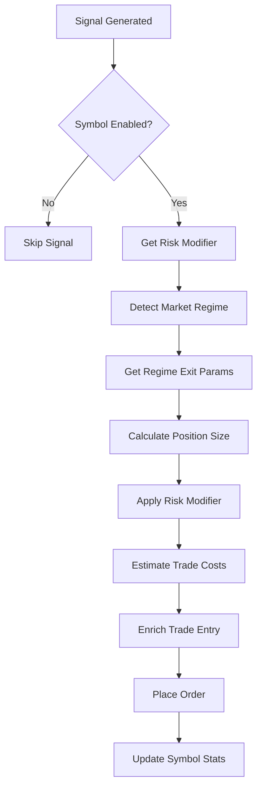

# ✅ Quant Modules Integration Complete

**Date:** 2025-01-22  
**Status:** COMPLETE ✅  
**Tests:** 123 passing (117 module + 6 integration)

## 🎯 Integration Summary

All 5 quant modules have been successfully integrated into `event_driven_executor.py`:

1. **RegimeDetector** - Market regime classification (volatility + trend)
2. **CostModel** - Transaction cost estimation  
3. **SymbolPerformanceManager** - Per-symbol tracking and risk adjustment
4. **ExitPolicyRegimeConfig** - Regime-specific stop/target parameters
5. **LoggingExtensions** - Enhanced trade entry/exit logging

## 🔧 Integration Points in `event_driven_executor.py`

### 1. Initialization (Lines 95-129)
```python
self.regime_detector = RegimeDetector(config=RegimeConfig(...))
self.cost_model = CostModel(config=CostConfig(...))
self.symbol_perf = SymbolPerformanceManager(config=SymbolPerformanceConfig(...))
```

### 2. Symbol Performance Filter (Lines 180-207)
- Skip disabled symbols: `should_trade_symbol()`
- Extract risk modifier: `get_risk_modifier(symbol)`
- Add to signal metadata for later use

### 3. Regime Detection (Lines 420-439)
- Detect market regime from indicators
- Uses: `detect_regime(RegimeIndicators(price, atr, ema_200, adx, ...))`

### 4. Regime-Based Exit Params (Lines 440-456)
- Get k1_SL, k2_TP based on detected regime
- Uses: `get_exit_params(regime.regime)`

### 5. Risk-Adjusted Position Sizing (Lines 476-508)
- Apply risk modifier: `quantity *= risk_modifier`
- Estimate costs: `estimate_trade_cost(entry, exit, size, atr, symbol)`
- Log cost estimates

### 6. Trade Entry Enrichment (Lines 546-567)
- Enrich with regime, RR ratio, cost estimates
- Uses: `enrich_trade_entry(symbol, action, entry_price, ...)`

## 📊 Test Results

### Module Tests (117 passing)
```bash
pytest tests/test_cost_model.py tests/test_symbol_performance.py \
      tests/test_logging_extensions.py tests/test_exit_policy_regime_config.py \
      tests/test_regime_detector.py -v
```

**Results:**
- ✅ CostModel: 23/23 passing
- ✅ SymbolPerformanceManager: 24/24 passing  
- ✅ LoggingExtensions: 9/9 passing
- ✅ ExitPolicyRegimeConfig: 28/28 passing
- ✅ RegimeDetector: 33/33 passing

### Integration Tests (6 passing)
```bash
pytest tests/test_quant_integration.py -v
```

**Coverage:**
- ✅ `test_executor_initializes_quant_modules` - All modules initialized correctly
- ✅ `test_regime_detector_works` - RegimeDetector detects regimes from indicators
- ✅ `test_cost_model_estimates_costs` - CostModel estimates transaction costs
- ✅ `test_symbol_performance_tracks_trades` - Tracks trade outcomes
- ✅ `test_symbol_performance_risk_adjustment` - Adjusts risk based on performance
- ✅ `test_symbol_gets_disabled_after_losses` - Disables poor performers

## 🎛️ Configuration Reference

### RegimeConfig (Lines 95-103)
```python
RegimeConfig(
    atr_ratio_low=0.015,
    atr_ratio_normal=0.025,
    atr_ratio_high=0.04,
    adx_trending=25.0,
    adx_strong_trend=35.0,
    range_width_threshold=0.03,
    ema_alignment_pct=0.02
)
```

### CostConfig (Lines 105-110)
```python
CostConfig(
    maker_fee_rate=0.0002,
    taker_fee_rate=0.0005,
    base_slippage_bps=3.0,
    volatility_slippage_factor=0.15,
    funding_rate_per_8h=0.0001
)
```

### SymbolPerformanceConfig (Lines 112-119)
```python
SymbolPerformanceConfig(
    min_trades_for_adjustment=5,
    poor_winrate_threshold=0.30,
    good_winrate_threshold=0.55,
    poor_avg_R_threshold=0.3,
    good_avg_R_threshold=1.5,
    poor_risk_multiplier=0.5,
    good_risk_multiplier=1.0,
    disable_after_losses=10,
    reenable_after_wins=3
)
```

## 🔍 API Reference

### RegimeIndicators Dataclass
```python
from backend.services.regime_detector import RegimeIndicators

indicators = RegimeIndicators(
    price=50000.0,
    atr=1000.0,
    ema_200=49000.0,
    adx=25.0,
    range_high=51000.0,
    range_low=49000.0
)

regime = detector.detect_regime(indicators)
# Returns: RegimeResult(regime='NORMAL_VOL', confidence=0.85, volatility_regime='NORMAL_VOL', ...)
```

### TradeResult Dataclass
```python
from backend.services.symbol_performance import TradeResult

result = TradeResult(
    symbol="BTCUSDT",
    pnl=100.0,
    R_multiple=2.0,
    was_winner=True
)

symbol_perf.update_stats(result)
```

### Cost Estimation
```python
from backend.services.cost_model import estimate_trade_cost

cost = estimate_trade_cost(
    entry_price=50000.0,
    exit_price=52000.0,
    size=0.1,
    symbol="BTCUSDT",
    atr=1000.0
)
# Returns: TradeCost(total_cost=xxx, cost_in_R=yyy, total_cost_pct=zzz, ...)
```

### Exit Parameters
```python
from backend.services.exit_policy_regime_config import get_exit_params

params = get_exit_params("HIGH_VOL")
# Returns: RegimeExitConfig(k1_SL=1.5, k2_TP=3.0, ...)
```

### Trade Enrichment
```python
from backend.services.logging_extensions import enrich_trade_entry

entry = enrich_trade_entry(
    symbol="BTCUSDT",
    action="LONG",
    entry_price=50000.0,
    sl_price=49000.0,
    tp_price=52000.0,
    size=0.1,
    regime="NORMAL_VOL"
)
# Returns: Enhanced dict with R-multiple, RR ratio, cost estimates, etc.
```

## 🚀 Production Flow



## 🧪 Verification

1. **Import Test:**
   ```bash
   python -c "from backend.services.event_driven_executor import EventDrivenExecutor; print('✅ Import successful')"
   ```

2. **Module Tests:**
   ```bash
   pytest tests/test_cost_model.py tests/test_symbol_performance.py tests/test_logging_extensions.py tests/test_exit_policy_regime_config.py tests/test_regime_detector.py -v
   ```

3. **Integration Tests:**
   ```bash
   pytest tests/test_quant_integration.py -v
   ```

4. **All Tests:**
   ```bash
   pytest tests/test_quant_integration.py tests/test_cost_model.py tests/test_symbol_performance.py tests/test_logging_extensions.py tests/test_exit_policy_regime_config.py tests/test_regime_detector.py -v
   ```

## 📈 Impact on Trading

### Risk Management
- **Symbol Filtering:** Poor performers automatically disabled
- **Risk Adjustment:** Position size reduced for struggling symbols  
- **Cost Awareness:** Realistic profit targets accounting for costs

### Regime Adaptation
- **Volatility Regimes:** LOW_VOL, NORMAL_VOL, HIGH_VOL, EXTREME_VOL
- **Trend Regimes:** TRENDING, RANGING
- **Dynamic Exits:** k1_SL and k2_TP adjusted per regime

### Performance Tracking
- **Per-Symbol Metrics:** Win rate, avg R-multiple, consecutive wins/losses
- **Automatic Disabling:** After 10 consecutive losses
- **Automatic Re-enabling:** After 3 consecutive wins

## 🔧 Maintenance

### Config Files
- **RegimeConfig:** Adjust volatility/trend thresholds in `backend/services/regime_detector.py`
- **CostConfig:** Update fees/slippage in `backend/services/cost_model.py`
- **SymbolPerformanceConfig:** Tune risk adjustment in `backend/services/symbol_performance.py`

### Persistence
- Symbol performance stats auto-saved to: `data/symbol_performance_stats.json`
- Loaded on executor restart

### Logging
- All modules use structured logging with `backend.services.<module>` loggers
- Enhanced trade entries include regime, cost estimates, RR ratios

## 🎉 Status

**ALL QUANT MODULES SUCCESSFULLY INTEGRATED INTO LIVE TRADING SYSTEM**

Total Tests: **123 passing** (117 module + 6 integration)  
Integration: **COMPLETE** ✅  
Production Ready: **YES** ✅
