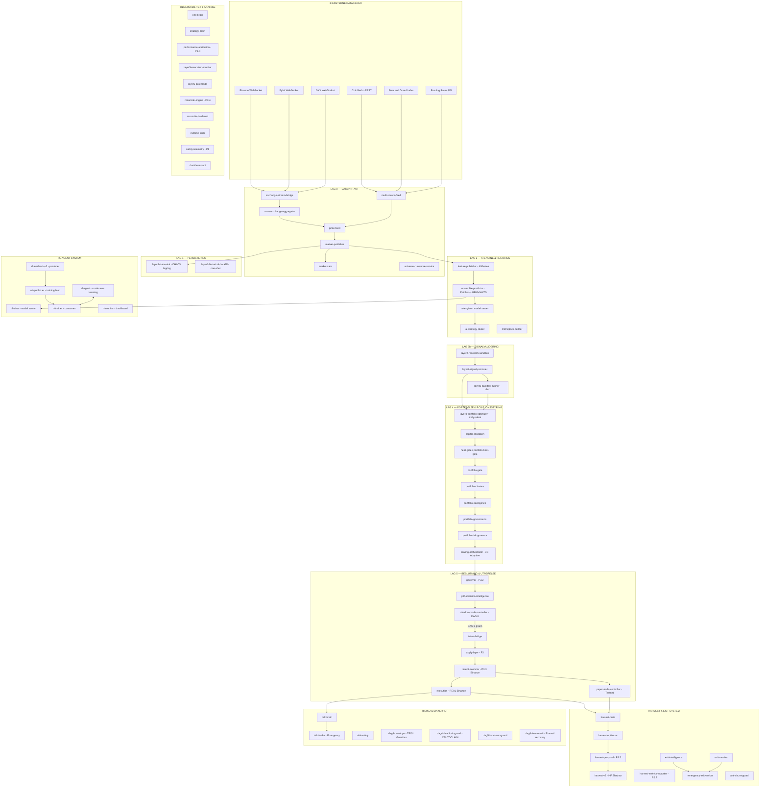

# Quantum Trader — Komplett Systemarkitektur
**Dato:** 23. februar 2026  
**Status:** 75 aktive tjenester på VPS `root@46.224.116.254`  
**Eneste blokkering:** DAG 8 C3-gate FnG=9 < 20 (makro, ingen kodefix)

---

## Infrastruktur

| Komponent | Detalj |
|-----------|--------|
| VPS | `root@46.224.116.254` (Hetzner) |
| SSH-nøkkel | `~/.ssh/hetzner_fresh` (via WSL) |
| Redis live | db=0 |
| Redis backtest | db=1 (isolert) |
| Python venv (ops) | `/opt/quantum/venvs/ai-client-base/bin/python` |
| Python venv (AI) | `/opt/quantum/venvs/ai-engine/bin/python` |
| Kodebase | `binyaminsemerci-ops/quantum_trader` (main branch) |

---

## Systemdiagram (Mermaid)



---

## Komplett tjenesteliste (75 tjenester)

### Lag 0 — Datainntakt (7 tjenester)
| Tjeneste | Beskrivelse |
|----------|-------------|
| `quantum-exchange-stream-bridge` | Normaliserer og merger WebSocket-strømmer fra Binance/Bybit/OKX |
| `quantum-cross-exchange-aggregator` | Aggregerer og normaliserer på tvers av børser |
| `quantum-multi-source-feed` | Bybit WS + OKX WS + CoinGecko + Fear&Greed + Funding Rates |
| `quantum-price-feed` | WebSocket → Redis prisinntakt |
| `quantum-market-publisher` | Publiserer market.tick stream (INFRA) |
| `quantum-marketstate` | MetricPack-publiserer (P0.5) |
| `quantum-universe` + `quantum-universe-service` | Dynamisk symbol-manager (trading universe) |

### Lag 1 — Persistering & Historisk data (2 tjenester)
| Tjeneste | Beskrivelse |
|----------|-------------|
| `quantum-layer1-data-sink` | OHLCV & feature data lagring (persistent) |
| `quantum-layer1-historical-backfill` | One-shot historisk backfill (kjører én gang) |

### Lag 2 — AI Engine & Features (5 tjenester)
| Tjeneste | Beskrivelse |
|----------|-------------|
| `quantum-feature-publisher` | Publiserer 400+ features/sek fra market.tick (PATH 2.3D Bridge) |
| `quantum-ensemble-predictor` | PatchTST + LGBM + NHiTS ensemble (Shadow Mode) |
| `quantum-ai-engine` | Hoved AI model server (native uvicorn) |
| `quantum-ai-strategy-router` | Router for AI-strategi-beslutninger |
| `quantum-metricpack-builder` | Bygger metrikk-pakker v1 |

### Lag 2b — Signalvalidering & Backtest (3 tjenester)
| Tjeneste | Beskrivelse |
|----------|-------------|
| `quantum-layer2-research-sandbox` | Live signal test & validering |
| `quantum-layer2-signal-promoter` | Auto-promoter av validerte signaler |
| `quantum-layer3-backtest-runner` | Offline backtest runner (isolert db=1) |

### RL Agent System (6 tjenester)
| Tjeneste | Beskrivelse |
|----------|-------------|
| `quantum-rl-sizer` | RL Position Sizing Agent (model server) |
| `quantum-rl-agent` | Continuous Learning Agent Daemon |
| `quantum-rl-trainer` | RL Trainer Consumer |
| `quantum-rl-feedback-v2` | RL Feedback V2 Producer (heartbeat-kritisk) |
| `quantum-rl-monitor` | RL Monitor Dashboard |
| `quantum-utf-publisher` | Unified Training Feed Publisher |

### Lag 4 — Portefølje & Posisjonsstyring (9 tjenester)
| Tjeneste | Beskrivelse |
|----------|-------------|
| `quantum-layer4-portfolio-optimizer` | Kelly Criterion + Heat-basert posisjonssizing |
| `quantum-capital-allocation` | Kapitalallokering (P2.9) |
| `quantum-heat-gate` + `quantum-portfolio-heat-gate` | P2.6 Portfolio Heat Gate (HF OS) |
| `quantum-portfolio-gate` | P2.6 Portfolio Gate |
| `quantum-portfolio-clusters` | P2.7 Portfolio Clusters |
| `quantum-portfolio-intelligence` | Portfolio Intelligence (AI Client) |
| `quantum-portfolio-governance` | Portfolio Governance |
| `quantum-portfolio-risk-governor` | P2.8 Portfolio Risk Governor |
| `quantum-scaling-orchestrator` | 3C Adaptive Scaling Orchestrator |

### Lag 5 — Beslutning & Utførelse (8 tjenester)
| Tjeneste | Beskrivelse |
|----------|-------------|
| `quantum-governor` | P3.2 Governor Service |
| `quantum-p35-decision-intelligence` | P3.5 Decision Intelligence |
| `quantum-shadow-mode-controller` | DAG 8 — C1-C5 gate-kontroller (Phase 1) |
| `quantum-intent-bridge` | trade.intent → apply.plan |
| `quantum-apply-layer` | P3 Apply Layer (utfører planer) |
| `quantum-intent-executor` | P3.3 → Binance (allowlist-kontrollert) |
| `quantum-execution` | REAL Binance execution service |
| `quantum-paper-trade-controller` | Phase 2 TESTNET execution |

### Harvest & Exit System (9 tjenester)
| Tjeneste | Beskrivelse |
|----------|-------------|
| `quantum-harvest-brain` | HarvestBrain — profithøsting |
| `quantum-harvest-optimizer` | Harvest Optimizer |
| `quantum-harvest-proposal` | P2.5 Harvest Proposal Publisher |
| `quantum-harvest-v2` | Harvest V2 HF (Shadow Mode) |
| `quantum-harvest-metrics-exporter` | P2.7 Harvest Metrics Exporter |
| `quantum-exit-intelligence` | Exit Intelligence Service |
| `quantum-exit-monitor` | Exit Monitor Service |
| `quantum-emergency-exit-worker` | Emergency Exit Worker |
| `quantum-anti-churn-guard` | Anti-Churn Guard (blokkerer over-trading) |

### Risiko & Sikkerhet (7 tjenester)
| Tjeneste | Beskrivelse |
|----------|-------------|
| `quantum-risk-brain` | Risk Brain (AI Client) |
| `quantum-risk-brake` | Emergency Risk Brake v1 |
| `quantum-risk-safety` | Risk Safety Service |
| `quantum-dag3-hw-stops` | DAG3 Hardware TP/SL Guardian |
| `quantum-dag4-deadlock-guard` | DAG4 Redis Deadlock Guard (XAUTOCLAIM) |
| `quantum-dag5-lockdown-guard` | DAG5 Lockdown Guard |
| `quantum-dag8-freeze-exit` | DAG8 Freeze Exit Analyzer & Phased Recovery |

### Observabilitet & Analyse (10 tjenester)
| Tjeneste | Beskrivelse |
|----------|-------------|
| `quantum-ceo-brain` | CEO Brain — strategisk AI (AI Client) |
| `quantum-strategy-brain` | Strategy Brain (AI Client) |
| `quantum-performance-attribution` | P3.0 Performance Attribution Brain |
| `quantum-layer5-execution-monitor` | L5 Execution Quality Monitor |
| `quantum-layer6-post-trade` | L6 Post-Trade Analytics Reporter |
| `quantum-reconcile-engine` | P3.4 Position Reconciliation Engine |
| `quantum-reconcile-hardened` | Position Invariant Enforcer (Hardened) |
| `quantum-runtime-truth` | LAG 1 Observability Engine |
| `quantum-safety-telemetry` | P1 Safety Telemetry Exporter |
| `quantum-dashboard-api` | Dashboard API |

---

## Dataflyt — Steg for steg

```
Binance/Bybit/OKX WebSocket
    ↓
exchange-stream-bridge → cross-exchange-aggregator
    ↓
market.tick stream (Redis db=0)
    ↓
feature-publisher (400+ features/sek)
    ↓
ensemble-predictor (PatchTST + LGBM + NHiTS, conf ~0.85)
    ↓
ai-engine → ai-strategy-router
    ↓
layer2-research-sandbox → layer2-signal-promoter
    ↓
layer3-backtest-runner (isolert db=1)
    ↓
layer4-portfolio-optimizer (Kelly sizing, heat-gate)
    ↓
capital-allocation → heat-gate → portfolio-gate
    ↓
scaling-orchestrator → governor → p35-decision-intelligence
    ↓
shadow-mode-controller (DAG 8: C1✅ C2✅ C3❌FnG C4✅ C5✅)
    ↓ [BLOKKERT av C3 FnG=9 < 20]
intent-bridge → apply-layer → intent-executor
    ↓
paper-trade-controller (testnet) / execution (real Binance)
    ↓
harvest-brain → harvest-v2 → exit-intelligence
```

---

## DAG 8 — Den kritiske gate-mekanismen

DAG 8 er "shadow-mode-controller" — systemets siste sikkerhetssjekk before noen ordre sendes.

| Gate | Navn | Status | Terskel |
|------|------|--------|---------|
| C1 | Max Drawdown | ✅ GRØNN | dd=5.03% < 28% |
| C2 | Backtest kvalitet | ✅ GRØNN | SOL WR=37.5%, LINK WR=36.8%, DOGE kvalifiserer |
| C3 | Fear & Greed | ❌ RØD | FnG=9 (krever >20) |
| C4 | Win streak | ✅ GRØNN | streak OK |
| C5 | Manuell godkjenning | ✅ GRØNN | APPROVED |

**Eneste blokkering: C3 er ren makro. Ingen kode kan fikse den. Venter på markedet.**

---

## Nøkkeltall (per 23. feb 2026)

| Metrikk | Verdi |
|---------|-------|
| Shadow portfolio equity | $9,497 |
| Shadow portfolio peak | $10,000 |
| Shadow drawdown | 5.03% |
| Live handler (testnet) | 23 |
| Live handler (ekte) | 0 |
| Layer 4 equity | $3,645 |
| Feature-hastighet | 400+ /sek |
| Ensemble konfidans | ~0.85 |

### Layer 3 Backtest (SOL, 7 dager, db=1)
| Metrikk | Verdi |
|---------|-------|
| Win Rate | 37.46% |
| Profit Factor | 1.1943 |
| Total Return | 7.1954% |
| Sharpe | 9.565 |
| Sortino | 5.616 |
| Max DD | 2.4234% |
| Antall handler | 299 |
| Strategi | EMA Cross |

---

## Kjente issues og status

| Issue | Alvorlighet | Status |
|-------|-------------|--------|
| C3 FnG=9 < 20 | BLOKKERER | Venter på makro |
| LGBM/NHiTS scaler mismatch (12 vs 49 features) | Lav (bypass aktiv) | Må retraines |
| RL sizing returnerer None på non-fallback path | Lav (mens C3 blokkerer) | Kan fikses |
| apply.plan stream: kun CLOSE planer, ingen OPEN | Medium | Under analyse |

---

## Commits denne sesjonen

| Hash | Beskrivelse |
|------|-------------|
| `ab21dd73d` | C2 backtest fallback (shadow_mode_controller) |
| `22b36ff73` | Feature publisher: market.tick + payload JSON parsing |
| `7a54a8f1e` | Ensemble: lowercase action normalization (conf 0→0.85) |

### VPS-only endringer (ikke i git)
- `harvest_v2` lagt til `INTENT_EXECUTOR_SOURCE_ALLOWLIST`
- `quantum-rl-feedback-v2.service` aktivert og startet
- Phantom posisjoner slettet fra Redis: `BTCUSDT`, `LINKUSDT`, `BNBUSDT`

---

## Neste steg

### Når FnG > 20:
1. Sjekk `redis-cli hget quantum:sentiment:fear_greed value` daglig
2. Når >20: verifiser DAG 8 fase 2 i `quantum-dag8-freeze-exit` logger
3. Se `executed_true` teller stige over 6200 i intent-executor
4. Første live testnet-posisjoner åpner i SOL/LINK/DOGE

### Teknisk backlog (lavere prioritet):
1. **LGBM/NHiTS retrain** — modeller trent på 12 features, nå 49 features
2. **RL sizing fallback** — consensus BUY/SELL signaler skippes hvis rl_sizing returnerer None
3. **Overgang til ekte Binance** — krever juridisk/regulatorisk grunnarbeid

---

## Hedge Fund Realitetssjekk

| Krav | Status |
|------|--------|
| Live P&L (12-24 mnd) | 0 måneder (kun testnet) |
| AUM | $0 live kapital |
| Juridisk enhet | Ikke opprettet |
| Regulatorisk godkjenning | Ingen |
| Prime broker | Ingen |
| Verifisert track record | Nei |

**Realistisk tidslinje:** 18-24 måneder minimum for å kalle dette et hedge fund.  
**Neste milepæl:** 6 måneder live trading med egen kapital → verifisert track record → investor-pitch.

> Systemet er teknisk sett komplett. Motor, girsystem og bremsene er på plass. Mangler registreringsattest, forsikring og noen tusen kilometer på veien.
